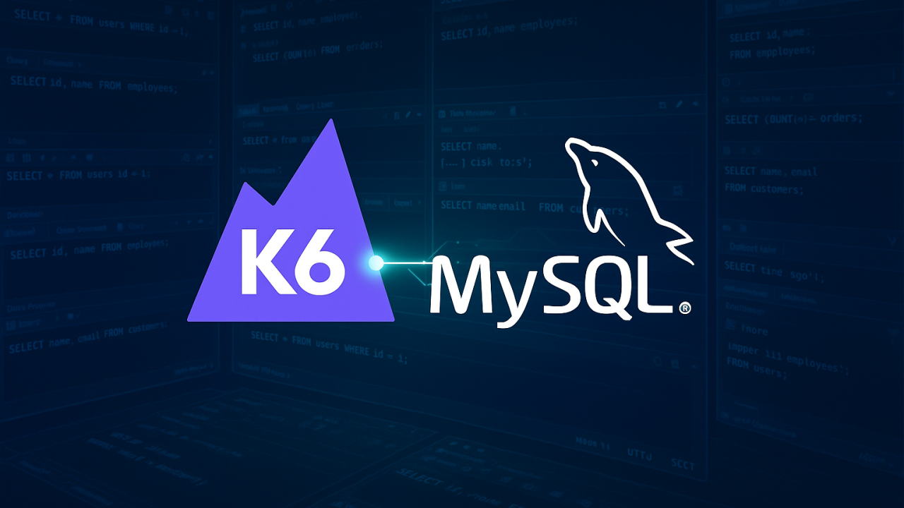

# Manipulando Banco de Dados MySQL com K6: O Guia que Você Não Sabia que Precisava!



🚀 Você já conhece o K6 para testar APIs, mas sabia que também dá para conectar em bancos de dados como MySQL? Sim, é isso mesmo! Bora deixar o "SELECT 1+1" brilhando nas métricas! 😎

Hoje vou te mostrar, de forma muito didática, como usar o K6 para:

- Conectar no MySQL
- Criar e alterar tabelas
- Fazer consultas
- Entender erros comuns


🧰 Dependências Necessárias

Antes de sair gritando k6 run teste.js, você precisa de alguns ingredientes:

🍔 Instalar o xk6 (builder de extensões do K6):

```bash
go install go.k6.io/xk6/cmd/xk6@latest
```

🍔 Depois, construir seu próprio K6 com suporte a SQL:

```bash
xk6 build --with github.com/grafana/xk6-sql --with github.com/grafana/xk6-sql-driver-mysql
```

🥤 Resultado? Um novo arquivo k6 ou k6.exe, turbinado para falar com bancos de dados!

(PS: Se você não tem Go instalado, corre lá: sudo apt install golang no seu WSL.)

🔌 Configurando a Conexão
Criamos o arquivo teste-mysql.js:

```javascript
import sql from 'k6/x/sql';
import driver from "k6/x/sql/driver/mysql"

// Conexão com o banco de dados MySQL
const db = sql.open(driver , 'usuario:senha@tcp(localhost:3306)/nome_do_banco');

export default function () {
    // aqui virão nossos comandos!
}

export function teardown() {
    db.close(); // fecha a conexão após o teste
}
```

✨ Dica de ouro: Use senhas fortes, nada de 1234, hein? Senão até o seu gato vai conseguir logar!

🛠️ Criando, Consultando e Alterando Tabelas
Agora sim, vamos brincar de DBA no K6!

```javascript
// Criar Tabela
db.exec(`
    CREATE TABLE IF NOT EXISTS usuarios (
        id INT AUTO_INCREMENT PRIMARY KEY,
        nome VARCHAR(255) NOT NULL,
        email VARCHAR(255) NOT NULL UNIQUE
    );
`);
Inserir Dados
db.exec(`
    INSERT INTO usuarios (nome, email)
    VALUES ('Alice Silva', 'alice@example.com');
`);
Consultar Dados
const results = db.query('SELECT * FROM usuarios');
console.log(`Usuários cadastrados: ${JSON.stringify(results)}`);
Atualizar Dados
db.exec(`
    UPDATE usuarios
    SET nome = 'Alice Souza'
    WHERE email = 'alice@example.com';
`);

```

Tudo isso dentro do default function() ou em funções específicas.

🔎 Como Interpretar Retornos
Ao fazer consultas (db.query), o K6 retorna arrays de objetos JSON.

Exemplo:

[
  { "id": 1, "nome": [80,101,116,101,114], "email": [87,101,110,100,121] }
]

Ou seja, o MySQL está retornando os dados binários (Buffer) ao invés de strings lidas normalmente.

✅ Como Resolver
No K6, usando o xk6-sql, os dados binários (tipo VARCHAR, TEXT) precisam ser convertidos manualmente em string.

Você pode fazer é criar uma função que automaticamente percorre todas as colunas de todas as linhas do banco, e se encontrar array de bytes, converte para string.

Assim você poderá usar o mesmo código em qualquer consulta, sem precisar se preocupar em adaptar campo por campo.

Aqui está:

```javascript
// Função para converter automaticamente qualquer Buffer em string
function normalizeResults(results) {
    return results.map(row => {
        const normalizedRow = {};
        for (const key in row) {
            if (Array.isArray(row[key])) {
                normalizedRow[key] = String.fromCharCode(...row[key]);
            } else {
                normalizedRow[key] = row[key];
            }
        }
        return normalizedRow;
    });
}

export default function () {
    const rawResults = db.query('SELECT * FROM usuarios');
    const users = normalizeResults(rawResults);

    console.log(JSON.stringify(users, null, 2));
}
```

🎯 O que esse código faz:
- Pega todas as linhas (results).
- Para cada coluna:
- Entrega tudo bonitinho em JSON legível.

✅ Agora seu script está:
Dinâmico: Funciona para qualquer tabela e qualquer consulta.
Seguro: Não altera números, datas ou valores que já estão corretos.
Automatizado: Não precisa mais especificar nome de coluna.

Exemplo de saída após conversão:
[
  {
    "id": 1,
    "nome": "Alice Silva",
    "email": "alicesilva@example.com"
  },
  {
    "id": 2,
    "nome": "Alice Braga",
    "email": "alicebraga@example.com"
  }
]

⚠️ Possíveis Erros de Configuração
Nem tudo são flores quando a gente mistura K6 com MySQL. Às vezes aparecem umas mensagens de erro que parecem brigar com a nossa paciência. Vamos ver os mais comuns e como resolver cada um:

🔸 Erro: Public Key Retrieval is not allowed Isso acontece porque o MySQL, nas versões mais novas, exige uma autorização especial para recuperar a chave pública durante o login. 👉 Solução: Basta adicionar ?allowPublicKeyRetrieval=true&useSSL=false na string de conexão com o banco.

🔸 Erro: Cannot find module 'k6/x/sql' Esse é clássico: ele acontece quando tentamos rodar um script que usa SQL sem ter um K6 personalizado (aquele construído com o xk6-sql). 👉 Solução: Refaça o build do seu K6 usando o xk6, adicionando a extensão de SQL.

🔸 Erro: Authentication plugin 'caching_sha2_password' Esse é mais traiçoeiro e aparece porque o MySQL 8 e 9 mudaram o sistema de autenticação para caching_sha2_password, enquanto o cliente espera o modelo antigo. 👉 Solução: Mude o método de autenticação do seu usuário para mysql_native_password. Você pode fazer isso direto no MySQL com o comando:

ALTER USER 'seu_usuario'@'%' IDENTIFIED WITH mysql_native_password BY 'sua_senha';
FLUSH PRIVILEGES;
✨ Moral da história: se der erro, não surte! Na maioria das vezes, é só uma configuração que precisa de ajuste. Respire fundo, revise seu ambiente... e siga testando! 🚀

🎭 Prós e Contras de Usar K6 para Testar MySQL
✅ Prós
Pode integrar teste de API + banco no mesmo pipeline.
Fácil de fazer validações automáticas.
Super leve e escalável (K6 é rápido como um foguete 🚀).

🚫 Contras
Não é pensado para testes SQL muito complexos (não substitui ferramentas como JMeter para banco).
Construir o K6 customizado exige conhecer um pouco de Go.
Testar carga intensa em bancos precisa cuidado para não derrubar ambientes (não vá fazer while(true) INSERT sem limites 😅).

🏁 Conclusão
Testar MySQL com o K6 é como dar superpoderes para seu script de carga! E o melhor: tudo dentro do ecossistema simples e elegante do K6.

Então já sabe:

Suba seu container MySQL (ou use o da empresa).
Monte seu K6 turbinado.
E comece a brincar de DBA performático!