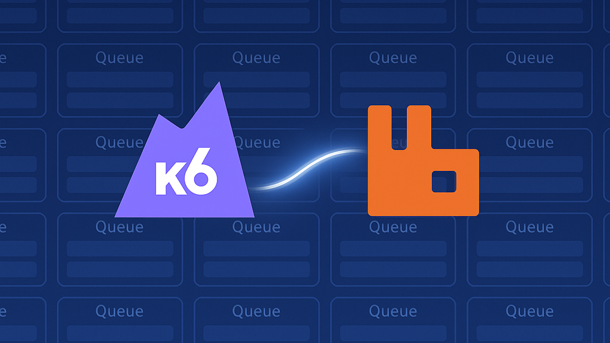
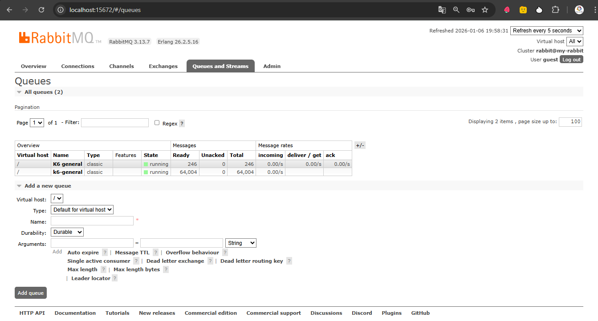
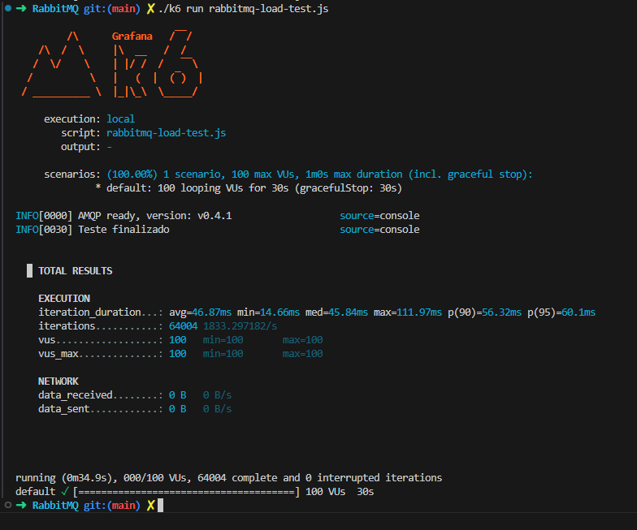

# 🧪📦 Testes de Carga com RabbitMQ usando K6



Mas antes precisamos aprender...

- [O que é Message Broker](./broker.md)
- [O que é RabbitMQ](./rabbitmq.md)
- [Quais as alternativas de Message Broker](./alternativas.md)

Se você já teve que lidar com filas de mensagens como o RabbitMQ, provavelmente conhece bem aquele dilema:

"Será que meu sistema aguenta milhares de mensagens por segundo sem perder a compostura?"

Uma abordagem poderosa de como realizar testes de carga em filas AMQP com o K6, usando a extensão xk6-amqp, desenvolvida pela equipe da Grafana Labs.

🧰 O Que é o xk6-amqp?
xk6-amqp é uma extensão customizada do K6 (ferramenta de testes de performance da Grafana) que permite interagir com servidores AMQP, como o RabbitMQ.

Essa extensão oferece suporte para:

- Conectar a servidores AMQP
- Declarar filas
- Publicar mensagens
- Escutar mensagens (consumir)

---

🚧 Preparando o Terreno: Ambiente de Testes

Arquitetura:

```bash
.
├── k6
└──rabbitmq-load-test.js

0 directories, 2 files

```

Requisitos:

- [Instalação do K6](https://grafana.com/docs/k6/latest/set-up/install-k6/)

Verificar a versão instalada:

```bash
k6 --version
```

Saída esperada:

```bash
k6 v1.5.0 (commit/7961cefa12, go1.25.5, linux/amd64)
```

- [Instalação do Docker Desktop](https://docs.docker.com/desktop/setup/install/windows-install/)
- [Instalação do GOLANG](https://go.dev/)

Verificar a versão instalada:

```bash
go version
```

Saída esperada:

```bash
go version go1.25.5 linux/amd64
```

- [Instalação do XK6](https://github.com/grafana/xk6)

```bash
go install go.k6.io/xk6/cmd/xk6@latest
```

Verificar a versão instalada:

```bash
xk6 version
```

Saída esperada:

```bash
xk6 version 1.3.2
```

---

1️⃣ Criar o K6 com suporte a AMQP

O K6 padrão não suporta AMQP, então precisamos de uma versão customizada:

```bash
xk6 build --with github.com/grafana/xk6-amqp
```

Saída esperada:

```bash
xk6 build --with github.com/grafana/xk6-amqp
7:20PM INF Building new k6 binary (native)
7:20PM INF Initializing Go module
7:20PM INF Creating k6 main
7:20PM INF adding dependency go.k6.io/k6@latest
7:21PM INF importing extensions
7:21PM INF adding dependency github.com/grafana/xk6-amqp
7:21PM INF Building k6
7:22PM INF Build complete
7:22PM INF Cleaning up work directory /tmp/k6foundry3747067470
7:22PM INF Successful build platform=linux/amd64
7:22PM INF added module=go.k6.io/k6 version=v1.5.0
7:22PM INF added module=github.com/grafana/xk6-amqp version=v0.4.1
7:22PM INF A new binary has been built based on k6 version=v1.5.0

xk6 has now produced a new k6 binary which may be different than the command on your system path!
Be sure to run './k6 run <SCRIPT_NAME>' from the '/home/rfahham/projetos/projetos-k6' directory.
```

2️⃣ Suba o RabbitMQ (caso ainda não esteja rodando) - RabbitMQ rodando localmente via Docker:

```bash
docker run -d --hostname my-rabbit --name some-rabbit -p 5672:5672 -p 15672:15672 rabbitmq:3-management
```

Acesse o painel:
👉 http://localhost:15672

Usuário: guest | Senha: guest



Pronto! Agora temos um K6 turbinado com suporte a filas.

3️⃣ Execute o teste:

```bash
./k6 run rabbitmq-load-test.js
```



👂 Finalmente, registramos um listener para consumir mensagens da fila. Assim que uma mensagem entra, ela é processada — neste caso, apenas impressa no console.

---

## ⚖️ Prós e Contras
✅ Vantagens:

K6 já é uma ferramenta bem estabelecida para testes de carga HTTP — e com xk6-amqp expande para mensageria.
Simples de escrever e executar scripts.
Pode ser integrado a pipelines CI/CD.
Suporte a múltiplas conexões, filas, e cenários avançados.

❌ Limitações:

Ainda em desenvolvimento ativo — não tão robusto quanto outras ferramentas dedicadas ao AMQP.
Falta suporte a recursos mais avançados como transações, tópicos complexos, e autenticações seguras.
Requer compilação customizada do K6.

---

💡 Casos de Uso Interessantes
Simular milhares de produtores ou consumidores de mensagens simultaneamente.
Medir latência da fila sob carga.
Testar comportamento do sistema em picos de envio (por exemplo: Black Friday, ou quando o estagiário solta um loop infinito 😬).

---

📈 Conclusão
Testar RabbitMQ com o K6 é uma abordagem moderna, elegante e flexível. Ideal para quem já usa K6 para APIs e quer ir além — agora testando mensageria assíncrona com a mesma familiaridade.

Se você ainda não brincou com xk6-amqp, recomendo fortemente. E lembre-se:

“Se você não testar sua fila, um dia ela vai testar você.” 😅
